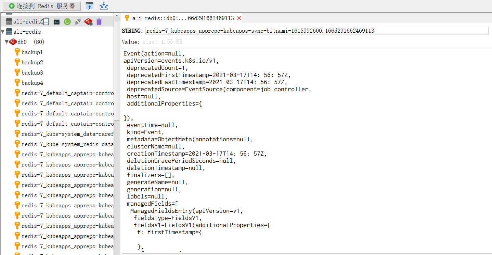
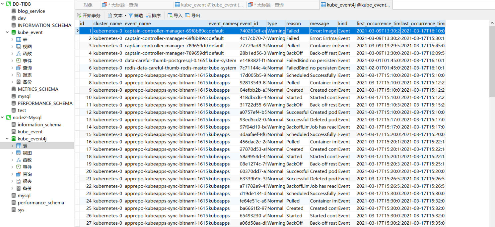
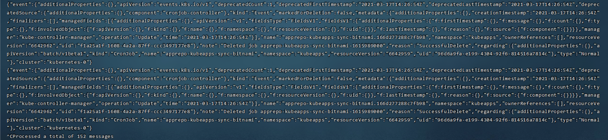
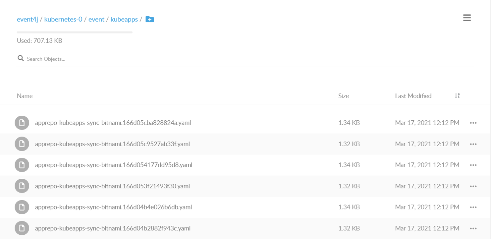

## Kube-eventer4j


### 这是什么？
  &nbsp;&nbsp;&nbsp;&nbsp;本项目参考Go语言的Kube-eventer项目，实现了一版基于Java的Kube-eventer，即Kube-eventer4j。Kube-event4j是一个事件发送程序，用来把Kubernetes实时的Event信息，推送给不同的客户端（例如Redis、MySQL、Kafka等）。  
  
  &nbsp;&nbsp;&nbsp;&nbsp;如果您想要了解什么是Kubernetes，请点击[what-is-kubernetes](https://kubernetes.io/docs/concepts/overview/what-is-kubernetes/)。  
  &nbsp;&nbsp;&nbsp;&nbsp;如果您想要了解什么是Kube-eventer，请点击[Kube-eventer](https://github.com/AliyunContainerService/kube-eventer)。  
  
  &nbsp;&nbsp;&nbsp;&nbsp;该项目主要起源学习Java、Kubernetes两年进行的实践，仅做学习使用。相比Kube-eventer原有实现的9种sink，实现了4种sink，新增了redis sink、minio sink两种客户端。设计上该项目提升了Kubernetes Client版本，支持Kubernetes 1.20.2的资源模型。采用Token连接Kuberetes集群的方法，代替原有的域名连接Apiserver的方法，从而支持多Kubernetes集群Event收集。  


  &nbsp;&nbsp;&nbsp;&nbsp;涉及知识点:
- Kubernetes基础知识
- Java多线程
- Redis Mysql Kafka Minio Java客户端使用
- 策略模式


| 功能特性 | kube-event | kube-event4j |
| :--- | :--- | :---: |
| 支持dingtalk、es、wechat等9种中间件 | 是 | 否 |
| 支持MySQL kafka | 是 | 是 |
| 支持Redis Minio | 否 | 是 |
| 支持多Kubernetes集群 | 否 | 是 |


### 如何使用？


0.使用Kube-eventer4j需要获得Kubernetes集群Token(类似设计的有Kubernetes dashboard 、KubeApps dashboard)。您需要知道如何获得对应权限的Token（[Kubernetes authentication](https://kubernetes.io/docs/reference/access-authn-authz/authentication/)）。


1.安装Kube-eventer4j，并配置对应sink，目前可以配置的有Redis、MySQL、Kafka、Minio。
当然由于使用Token，不必一定选择Kubernetes集群进行部署。Java启动、Docker启动都是可以的。


```shell
java -jar eventer4j-0.1.0.jar --source=[your_source_code] --sink=[your_sink_code]
```


```shell
docker run jiangnanshi/kube-eventer4j:0.1.0 --source=[your_source_code] --sink=[your_sink_code]
```


```yaml
apiVersion: apps/v1
kind: Deployment
metadata:
  labels:
    name: kube-eventer4j
  name: kube-eventer4j
  namespace: kube-system
spec:
  replicas: 1
  selector:
    matchLabels:
      app: kube-eventer4j
  template:
    metadata:
      labels:
        app: kube-eventer4j
    spec:
      containers:
        - image: jiangnanshi/kube-eventer4j:0.1.0
          name: kube-eventer4j
          env:
            # If TZ is assigned, set the TZ value as the time zone
            - name: TZ
              value: "Asia/Shanghai"
            - name: source
              value: "kubernetes:url=[your_k8s_apiserver like https://47.111.145.31:6443]&token=[your_k8s_token]"
            - name: sink
              value: "minio:url=[your_minio_url]&accessKey=[your_accessKey]&secretKey=[your_secretKey]&bucket=[your_bucket];
                      redis:url=[your_redis_url]&requirepass=[your_redis_password  Default value : none];
                      kafka:brokers=[your_brokers like 101.37.160.226:9091,101.37.160.226:9092]&eventstopic=[your_topic_name];
                      mysql:url=[your_webhook_url like https://116.85.64.120:4000/kube_event4j]&username=[your_username]&password=[your_password]"
          resources:
            requests:
              cpu: 100m
              memory: 100Mi
            limits:
              cpu: 500m
              memory: 250Mi
```


2. 查看各个sink对应的Event输出




_*Redis sink 接受Kubernetes events*_




_*Mysql sink 接受Kubernetes events*_



_*Kafka sink 接受Kubernetes events*_



_*MInio sink 接受Kubernetes events*_


### 协议

本作品代码采用 [Apache 2.0协议](https://www.apache.org/licenses/LICENSE-2.0)进行许可。遵循许可的前提下，你可以自由地对代码进行修改，再发布，可以将代码用作商业用途。
